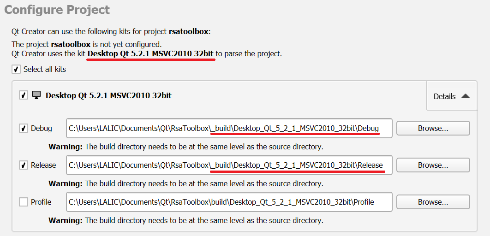
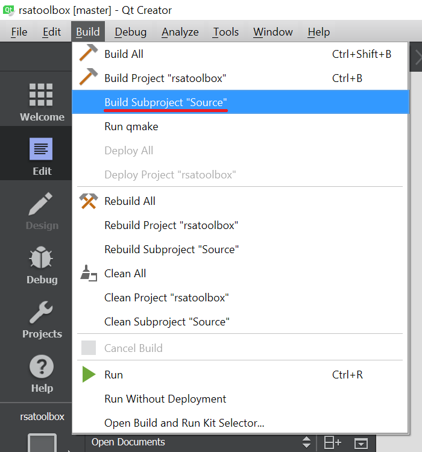
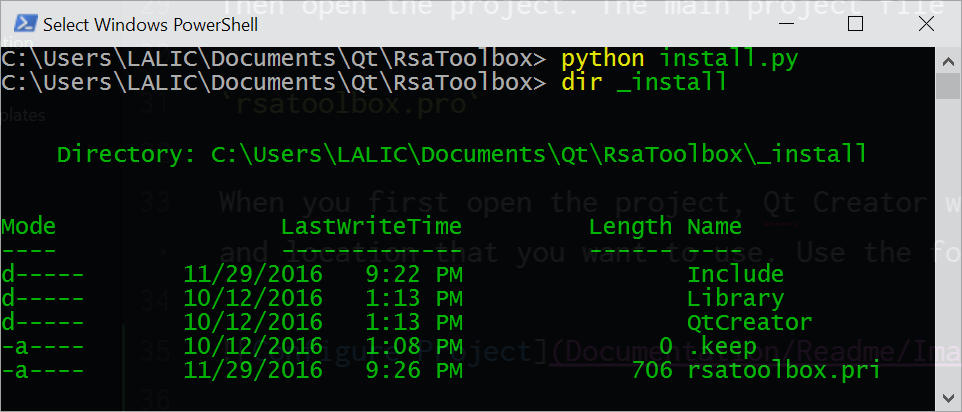
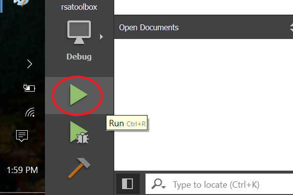
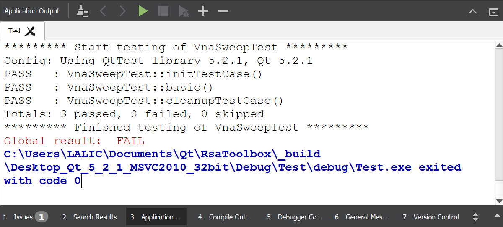
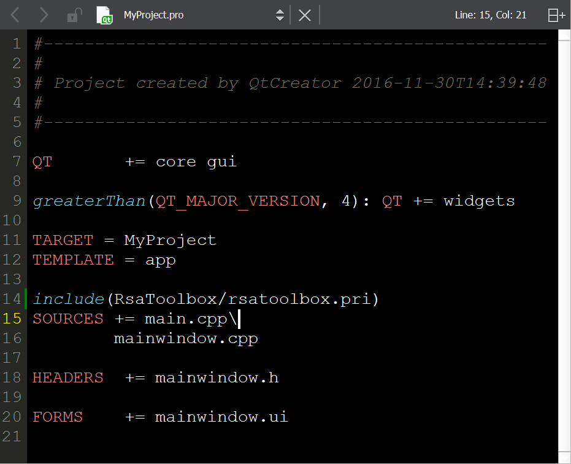

RsaToolbox
==========

`RsaToolbox` is a library written in C++ with Qt 5 for control of Rohde & Schwarz general test equipment.

Requirements
------------
RsaToolbox should work with any version of Qt 5. That said, it has only been used and tested with the open source (LGPL & GPL) distribution of Qt 5.2.1 compiled for Windows using Visual C++ 2010 x86 and DirectX. This is to support installation on older instruments still running Windows XP Embedded Service Pack 2 (Qt 5.2.1 has been extensively tested on this instrument platform).

As Windows XP instruments dwindle, development and test will move to a newer version of Qt 5.

### Visual C++ 2010 x86
The Visual C++ 2010 installer download has been buried on the web (Microsoft wants us all to migrate). Here is a link that is working as of 11/2016:
[Microsoft Visual Studio 2010 Express Edition](https://www.microsoft.com/en-us/download/details.aspx?id=23691)

### Qt 5.2.1 for Visual C++ 2010 x86 and DirectX
Qt 5.2.1 can be installed using the Qt online installer found here:
[Qt Open-source Online Installer for Windows](https://www.qt.io/download-open-source/)

Choose and install Qt 5.2.1 compiled for Visual C++ 2010 32-bit (x86) with DirectX graphics support (*not* OpenGL).

### Python
A few simple scripts are included for deploying `RsaToolbox`. To run these, you will need python installed on your system. The version of python does not matter; the scripts work with both python 2.7 and 3.x.

Build and Install
-----------------

The following steps assume that Visual C++ 2010 Express is installed, as well as Qt 5.2.1 (see links above).

First clone the project locally.

`git clone git@github.com:Terrabits/RsaToolbox.git`

Then open the project. The main project file is in the root directly of the project.

`rsatoolbox.pro`

When you first open the project, Qt Creator will ask you choose the build package and location that you want to use. Use the following settings:

Then build the subproject `Source`.

Note: the warning that "The build directory needs to be at the same level as the source directory" can be safely ignored.

Next, run the included utility `install.py`, which will populate the `_install` directory with the files needed to deploy `RsaToolbox`. This includes the headers, debug and release static libraries and a qmake project include file.

If a Rohde & Schwarz VNA simulator is running locally, the optional `Test` project can be built and run to perform some basic unit tests. Note that these tests are incomplete and some currently fail; they are a work in progress. Nonetheless, running them is an indication that the build and install process completed successfully.

Using in a Qt Project
---------------------

If the steps above completed successfully, the contents of the `_install` directory can be used to add `RsaToolbox` to a project. Copy this folder to the desired Qt Project and rename it `RsaToolbox`.

The `rsatoolbox.pri` `qmake` include file will configure your project to use `RsaToolbox`: add the following line to the project's .pro file, typically just above the file includes section.

`include(RsaToolbox/rsatoolbox.pri)`

